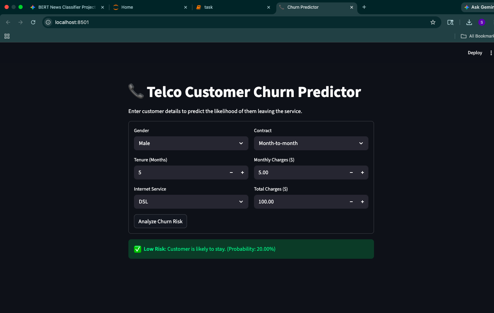

📞 Customer Churn Prediction Pipeline
This project implements a reusable and production-ready machine learning pipeline to predict customer churn. It demonstrates the use of the Scikit-learn Pipeline API to bundle data preprocessing and model inference into a single, deployable object.

🚀 Project Objective
The goal of this task was to create an end-to-end workflow for the Telco Churn dataset that:

Automates Preprocessing: Handles scaling for numerical data and one-hot encoding for categorical data.

Model Optimization: Compares multiple algorithms (Logistic Regression vs. Random Forest) and tunes hyperparameters.

Deployment Ready: Exports a serialized "pipeline" file that can be used for instant inference in a web app.

🛠️ Tech Stack
Modeling: Scikit-learn (Pipeline, ColumnTransformer, GridSearchCV)

Interface: Streamlit

Serialization: Joblib

Data Analysis: Pandas, NumPy