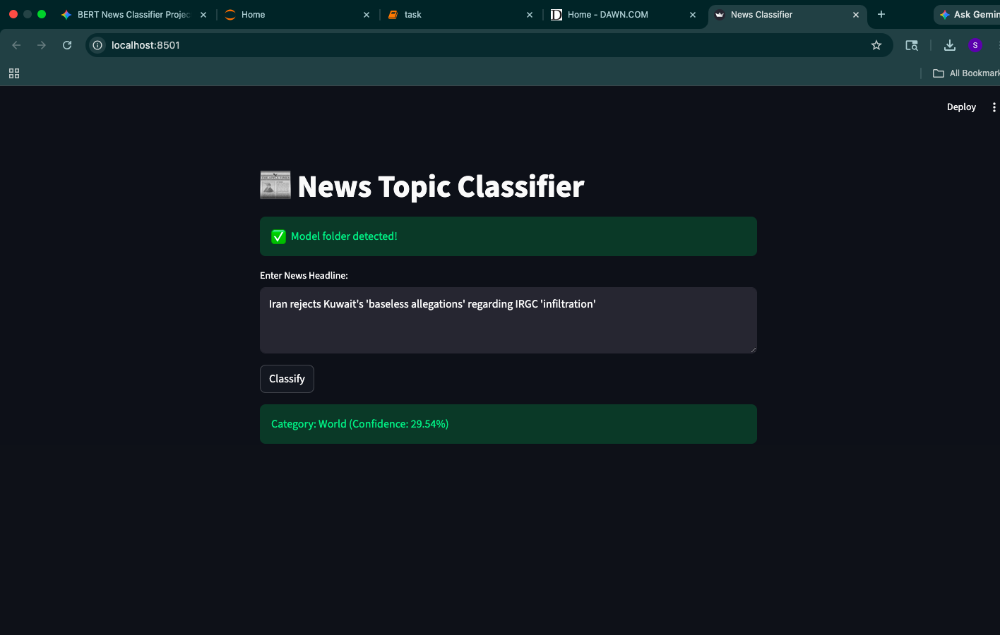

📰 News Topic Classifier using BERT (DistilBERT)
An end-to-end Machine Learning project that fine-tunes a Transformer model to categorize news headlines into four distinct topics. This project demonstrates the full ML lifecycle: Data Preprocessing, Model Fine-Tuning, Evaluation, and Deployment.

🚀 Overview
This repository uses a lightweight version of BERT called DistilBERT to classify news text from the AG News Dataset. By utilizing the Hugging Face transformers library, the model is trained to recognize patterns in headlines and assign them to one of the following categories:

World (Label 0)

Sports (Label 1)

Business (Label 2)

Sci/Tech (Label 3)

🛠️ Tech Stack
Language: Python

ML Framework: PyTorch & Hugging Face Transformers

Deployment: Streamlit

Data Handling: Pandas & Datasets

Model: distilbert-base-uncased